# 豬籠草種植清單

這裡會記載現有的豬籠草清單，可以依照想要看的類別去點入。~~但如果有不是的混進去了也是蠻正常的事情喔。~~  
最後更新日期：2024/03/31

## 好種區

### 艾瑪莉  Emmarene

***
表現：紅斑瓶身帶紅色波浪唇，上下位差異小。夠成熟的下位瓶可以很紅  
敘述：古老的超強~~超野~~園藝種，非常耐操，很容易結瓶的好夥伴，目前已經多芽叢生跟新底座芽竄出

***

### 米蘭達  Miranda

***
表現：下位-長直斑瓶宏波浪唇，上位-高腳杯綠瓶波浪花唇  
敘述：好種植的經典園藝交種，一年四季都無懼，是棵公的，目前多芽叢生

***

### 維京  viking

***
表現：下位-不詳，上位-綠瓶棕色素唇  
敘述：好種植的原種，冬天可能會變成觀葉植物，確認是棵公的

***

### 六甲  Rokko

***
表現：下位-橘色斑瓶微花唇，上位-綠瓶微寬紅色花唇  
敘述：也是古老的園藝交種，生長速度快，不怕冷熱一直衝，但很容易轉為上位瓶  

***

### (葫蘆×辛布亞)×包希  (ventricosa × sibuyanensis) × boschiana

***
表現：沒錯...那瓶子就是一臉包希豬籠草的樣子  
敘述：不知道是不是因為葫蘆與辛布亞的基因，很容易吸引薊馬上門光臨，所以頂芽被攻擊到受傷，但生長勢還是很強

***

### (高棉×風鈴)×剛毛  (thorelii × campanulata) × hirsuta

***
表現：目前是很有斑點瓶身的圓胖瓶子，整體很剛毛...？  
敘述：剛收到的時候頂芽有點萎縮，但在夏季的時候快速復活，幾乎每葉有瓶子。不太怕冷熱但冬天生長超慢

***

### 風鈴×葫蘆  campanulata × ventricosa

***
表現：縮小版的葫蘆豬籠草，略有腰身的紅唇瓶子  
敘述：也是很能結瓶的交種，但不穩定會忽大忽小，一樣薊馬很愛。目前兩頭芽  

***

### 葫蘆(k)×盾葉毛  ventricosa(k) × peltata

***
表現：紅色斑瓶極上花唇，目前瓶子偏向兩親本的混合體  
敘述：不會讓人失望的好看交種，但也是薊馬很愛，目前1大芽1小芽

.jpg)
.jpg)
***

### 高棉×風鈴  thorelii × campanulata

***
表現：紅色瓶子個體，對於寒冷有一定抗性  
敘述：公花，1頂芽1側芽~~而且都很耐操~~
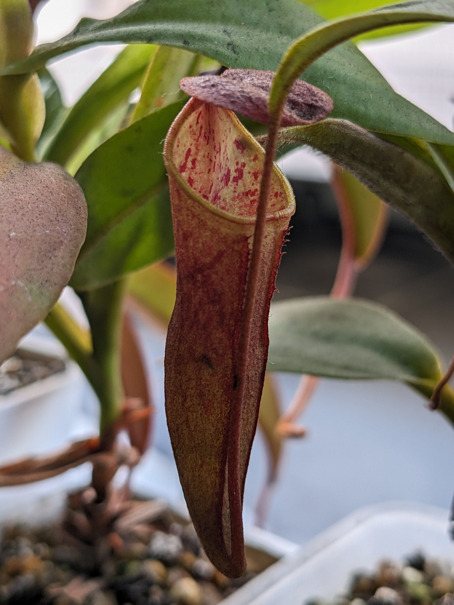
***

### 高棉×風鈴 MIT  thorelii × campanulata MIT

***
表現：目前看起來很像是有微微紅斑的風鈴豬籠草...  
敘述：很迷你的瓶子，目前穩定生長著
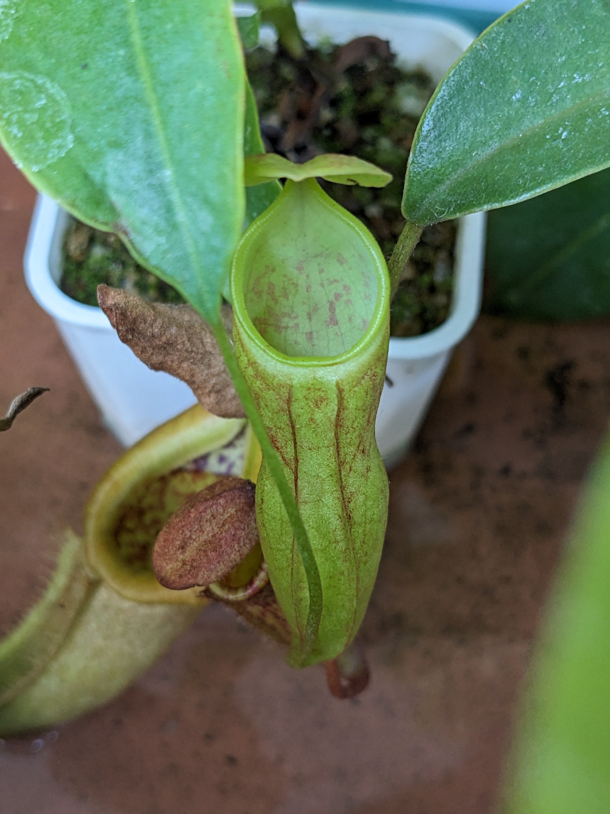
***

### 老虎×(勞氏×風鈴)  'Tiger' × (lowii × campanulata)

***
表現：偏冷時-紫色略寬唇的小瓶子，夏季-偏紅色斑紋瓶身帶微花唇  
敘述：不具冷熱的好交種，幾乎一直結瓶，目前1砍頭芽1側芽  
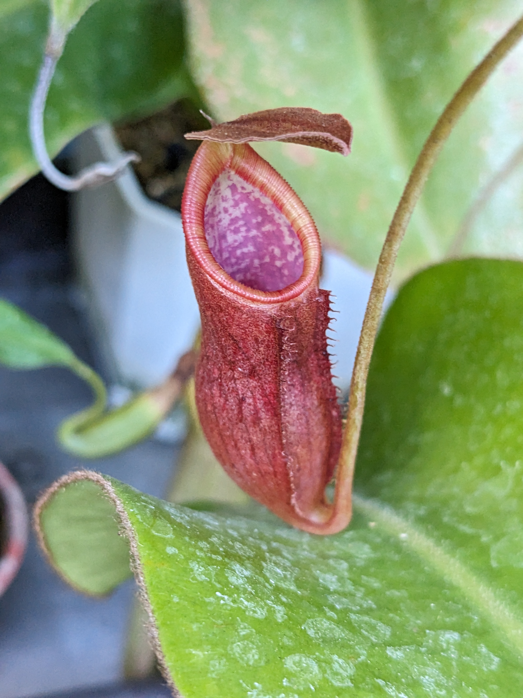

***

### (高棉×風鈴)×(勞氏×風鈴)  (thorelii × campanulata) × (lowii × campanulata)

***
表現：目前是像風鈴小巧可愛的瓶內斑瓶  
敘述：生長速度算快但不是很愛結瓶~~愛裝草~~的一棵豬籠草  

***

### 葫蘆×寶特瓶 紅唇個體  ventricosa × truncata no stripe

***
表現：寶特瓶般巨瓶，葫蘆般的紅色波浪唇  
敘述：葉展超大，雖然比艾瑪莉跟米蘭達小一點，但仍是很驚人，稍微怕熱但可以撐過夏天。目前多芽瘋狂

***

### 殭屍 ventricosa × khasiana

***
表現：跟艾瑪莉很像，只是瓶子較小，唇口不波浪  
敘述：生長很快，跟異父異母的艾瑪莉一樣快，但薊馬超級愛吃的  
扦插中：1芽

***

### 翼狀(b) alata(b)

***
表現：綠瓶子，曬夠久會紅瓶子，有點像試管的外貌，紅色唇  
敘述：其實是小花。好種好養原生種，真的是不怕冷熱，但超怕薊馬啊啊啊啊啊  

***

### 香蕉 Banana spp.

***
表現：黃綠色的瓶子帶有點碎紅斑，紅綠色花唇  
敘述：身世不詳的古老花市豬籠草，但實際上擁有的人很少

***

### 菲律賓 philippinensis

***
表現：橘色斑瓶微花唇  
敘述：好種植的原種，一年四季都無懼，只可惜是相當罕見就是了

***

### 勞氏×風鈴 lowii × campanulata

***
表現：成熟的瓶子是紅紫色，大嘴巴型態的瓶子  
敘述：超級好種植的勞氏豬籠草交種，不怕冷熱，但不一定每次都會有瓶子，目前有側芽

***

### 維奇複雜交1號 veitchii hyb. No.1

***
表現：成熟瓶為綠瓶身，帶有花唇，老瓶轉紅唇  
敘述：穩定成長，但似乎比較不喜歡太熱的天氣，好像混到寶特瓶基因？
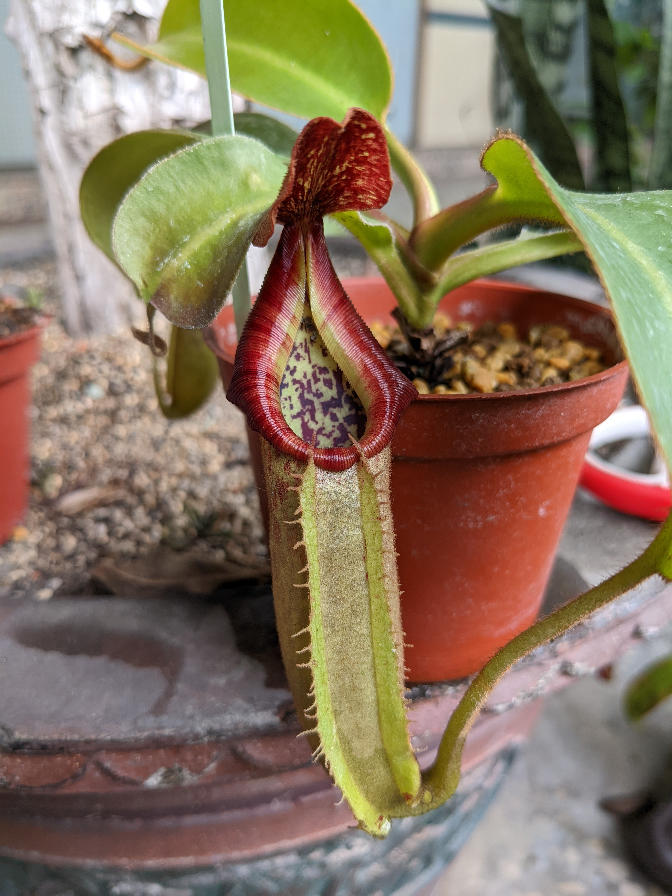
***

### 維奇複雜交2號 veitchii hyb. No.2

***
表現：瓶子看起來有點萊佛士的影子，一樣花唇，老瓶轉金棕色花唇  
敘述：穩定成長，但也不太喜歡熱天，結瓶的頻率比其他同批高一點

***

### 維奇複雜交3號 veitchii hyb. No.3

***
表現：未有成熟瓶，已知花唇  
敘述：雖然也是穩定長葉子但結瓶率卻是最差的
***

### 疑似豹斑交維奇 aff. burbidgeae×veitchii

***
表現：長得跟豹斑交維奇豬籠草有那麼點相似...但肯定不太一樣  
敘述：外觀真的很像豹斑交維奇豬籠草，不過血統上有差異，但葉子現在很大，大概有20公分的葉展，稍微怕熱  
狀態：被預訂

.jpg "2023的瓶子")
***

### 巧果/毛果 trichocarpa

***
表現：迷你可愛的瓶子，深紅色瓶子帶有紅綠花唇  
敘述：兩個可愛的原種交配起來的，但結瓶條件似乎有點刁鑽？相對怕冷  

.jpg)
***

### 奇異交種 mirabilis hyb

***
表現：看起來一直都很神祕，外表很奇異豬籠草  
敘述：不怕冷熱，但就是身世不詳，穩定成長中
***

### 黑維京月亮 viking × ampullaria-black miracle

***
表現：圓胖型深紅色瓶子但有紅綠色花唇，可以有手掌大的機會  
敘述：古老園藝豬籠草，在花市屬於最常見的一個品種

***

### 大豬×風鈴 maxima × campanulata

***
表現：縮小版的大豬籠草，有斑紋的瓶子搭配波浪唇  
敘述：大豬籠草為母親的交配種，瓶身很華麗而且相當好種植，幾乎都可以一直看到瓶子

***

### 風鈴×大豬 campanulata × maxima

***
表現：縮小版的大豬籠草，有斑紋的瓶子搭配波浪唇  
敘述：跟上面的是父母顛倒，以風鈴豬籠草為母親，但這似乎不影響好種的程度

***

### (葫蘆×辛布亞)×盾葉毛 (ventricosa × sibuyanensis) × peltata

***
表現：紅色瓶子帶有花唇，目前看起來長得很像盾葉毛的瓶型  
敘述：超級耐命的3血統交種，幾乎都可以長出瓶子，只是籠蔓很長需要給他空間伸展

***

### (維京×蘋果)×維奇 (viking  ×ampullaria) × veitchii

***
表現：圓胖的淺紅色瓶子，帶有紅綠色花唇  
敘述：相對好種植，但因為似乎是激素組織培養的品種，花了很久的時間才適應環境，然後莖節很短，幾乎疊在一起

***

### 維奇不明交種 veitchii spp. hyb.

***
來源：中部食蟲植物交流會
表現：很黃綠色的瓶身，有維奇豬籠草的身影  
敘述：適應良好的樣子，但是開始奇怪的長側芽了

***

### 寶特瓶不知名交種 truncata spp. hyb.

***
來源：中部食蟲植物交流會
表現：看起來很像寶特瓶...綠棕色瓶身帶有紅唇  
敘述：開始成長了，但速度很慢就是

***

### (寶特瓶×維奇)×包希 (truncata × veitchii) × boschiana

***
來源：異草堂  
表現：紅色瓶身的瓶子，但長得很包希?已經稍微有線唇了  
敘述：特殊的交配式，雖然賭很容易被包希的基因洗掉
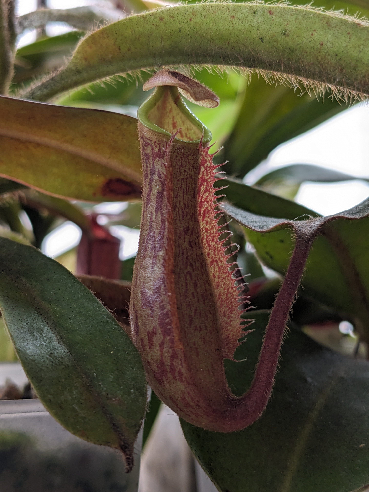
***

## 有點難種區

### 大豬不知交種 maxima hybrid

***
表現：感覺上是大豬籠草的交種，有斑紋的瓶身與紅色唇  
敘述：持續裝草中，葉子都會稍微畸形，但依舊持平的抽葉子
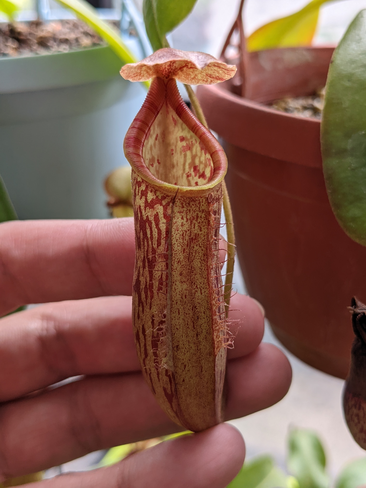
***

### 辛布亞×盾葉毛 sibuyanensis × peltata

***
表現：紅色帶棕色斑紋的瓶子，紅黑色的花唇，瓶型帶有點矮胖  
敘述：對環境需求有了點要求，但現在開始穩定結瓶，但也拖了有點久

***

### 辛布亞×美林 sibuyanensis × merrilliana

***
表現：綠色瓶身帶紅斑，矮胖的瓶型，會有紅色微波浪唇  
敘述：不是很耐熱，然後生長速度偏緩慢，但終於穩定下來了

***

### 風鈴×陳氏 campanulata × chaniana

***
表現：放大版的風鈴豬籠草，全身綠色，呈現蓮座型態的生長方式  
敘述：雖然穩定生長，但是瓶子生長率很看天氣的穩定度
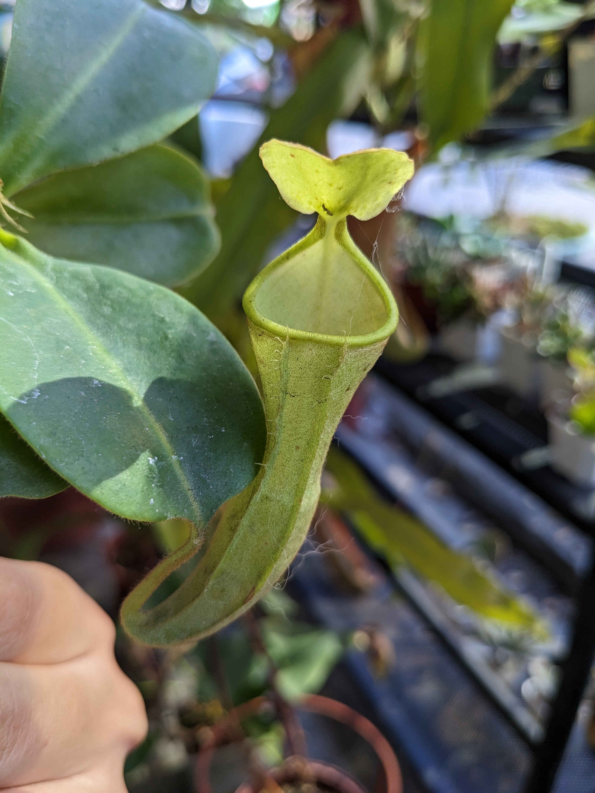
***

### 葫蘆×寶特瓶 矮花唇個體 ventricosa × truncata stripe

***
表現：極度像拉長的葫蘆豬籠草帶有顯性的波浪花唇  
敘述：比較怕熱，很容易中薊馬，但移除障礙因子後又可以快速恢復

***

### 寶特瓶×風鈴 truncata × campanulata

***
表現：目前看起來是瓶身帶有斑紋的風鈴豬籠草  
敘述：抓不到習性，但不至於掛掉，好像怕冷也怕熱，不過就是生長緩慢吧

***

### 葫蘆×'蒂維耶' A型態 ventricosa × 'Tiveyi' form A

***
表現：看起來很像...不知道，三種基因都不明顯，只有唇肋略有葫蘆的影子  
敘述：薊馬的愛，但其實除了蟲害應該不算難搞，小小怕熱，有降溫會長得很好

***

### 盾葉毛×驚奇 peltata × mira

***
表現：看起來很驚奇，但其實很普通，棕黃色瓶身素唇  
敘述：還沒抓到習性，但放養暫時無所謂，但似乎不要太熱才是好事

***

### 維京×諾斯 viking × northiana

***
表現：矮胖紅瓶帶有華麗的紅黃色花唇  
敘述：長不大的一棵，維持住在3吋盆的大小，很怕冷

***

### 顯目×葫蘆(深紅) spectabilis × ventricosa dark red form

***
表現：極度華麗的瓶身花紋與非常過分的漂亮紅黃色花唇，唇肋鋒利明顯  
敘述：有遮陰會好很多，但應該是可以讓他曬太陽，只是需要逐漸適應

***

### 辛布亞×大豬 sibuyanensis × maxima

***
表現：目前沒瓶子...  
敘述：可以長得很大棵，但薊馬愛上了他，目前除蟲有效後開始恢復生長了
***

### 貝里 × 黑寶特瓶 bellii × robcantleyi

***
來源：疑似是BE-3330(待確認的爭議性)  
表現：目前瓶子類似貝里豬籠草，太熱整個瓶子都是綠的  
敘述：有黑寶特瓶的基因讓種植難度變高了不少，但應該是撐住夏天了

***

### 風鈴×(包希×維奇) campanulata × (boschiana × veitchii)

***
表現：綠色的難養風鈴豬籠草...可是瓶身有紅斑也有花唇喔  
敘述：生長速度非常緩慢，被誰拖累不確定，但穩定的維持植株大小  

***

### 不知名交種 SPP.

***
來源：江合花市
表現：看起來不會翻唇的不知名交種，微微寬花唇  
敘述：有點飛盤樣的唇，但是現在也被薊馬盯上，需要時間恢復，也看起來不太喜歡熱天

***

### (大豬×包希)×寶特瓶  (maxima × boschiana) × truncata

***
表現：長的很像寶特瓶...？但有點腰身的瓶子？  
敘述：陷入了植株僵直的狀態，生長勢消失  

***

### 盾葉毛 peltata

***
表現：瓶子很毛的一棵，瓶身帶有花紋與花唇  
敘述：有點小怕熱，或許還是喜歡冷涼的天氣，畢竟是接近中地的原種，但不算難種植

.jpg)
***

### [(勞氏×包希)×維奇(K)- 𝑬𝑷]×(柔毛×維奇) [(𝒍𝒐𝒘𝒊𝒊 𝒙 𝒃𝒐𝒔𝒄𝒉𝒊𝒂𝒏𝒂) 𝒙 𝒗𝒆𝒊𝒕𝒄𝒉𝒊𝒊(𝑲) 𝑬𝑷] 𝒙 (𝒎𝒐𝒍𝒍𝒊𝒔 𝒙 𝒗𝒆𝒊𝒕𝒄𝒉𝒊𝒊)

***
表現：鮮豔帶有斑紋的紅色瓶子，黃底紅線花唇  
敘述：罕見挑戰高難度品種的交種，希望整體有柔毛豬籠草的表現
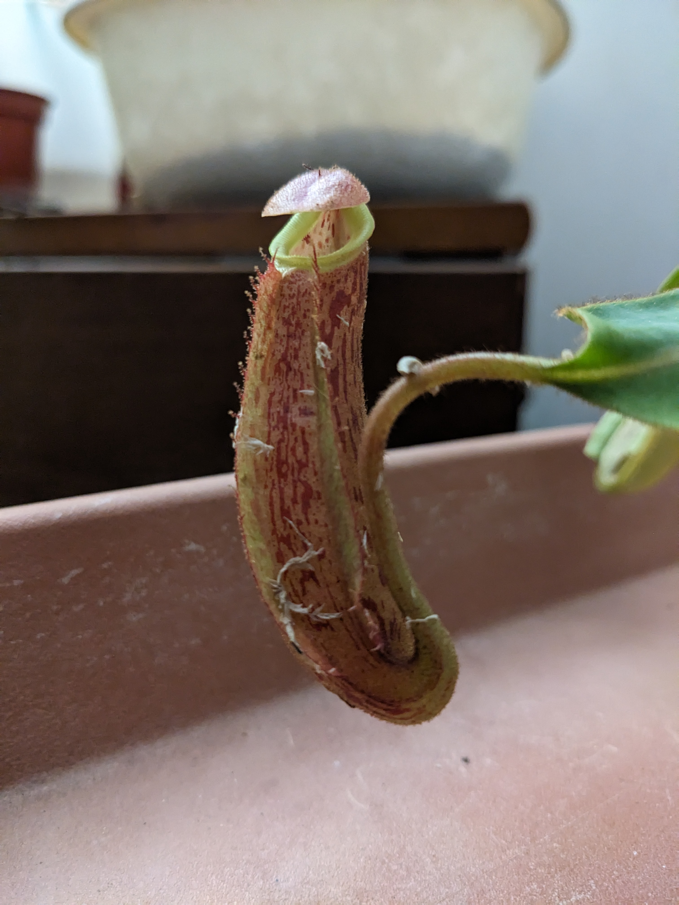
***

### [ 葫蘆×(勞式×窄葉) ]×'阿拉蒂' [ ventricosa × (lowii × stenophylla)] × 'Allardii'

***
表現：依舊不詳...  
敘述：來了先開花？！然後現在就等待復甦
***

### [ 葫蘆×(勞式×窄葉) ]×維奇 [ ventricosa × (lowii × stenophylla)] × veitchii

***
表現：沒看到瓶子呢...  
敘述：扦插後很穩定的持續著，但是不結瓶呢
***

### 維京不詳交種 viking unknown hyb

***
表現：沒看到瓶子呢...  
敘述：感覺有點糟糕，生長勢停滯了很久
***

### 維京×蘋果(綠色個體) viking × ampullaria(green form)

***
表現：據說是綠色的瓶子？  
敘述：有開始抽出新葉子了，但仍在適應  
***

### 不明1號 unknown hyb no.1

***
來源：八角亭花市  
表現：看起來是大豬籠草的交種？  
敘述：生長勢超級強健，直接大跳葉，一片葉子至少15公分
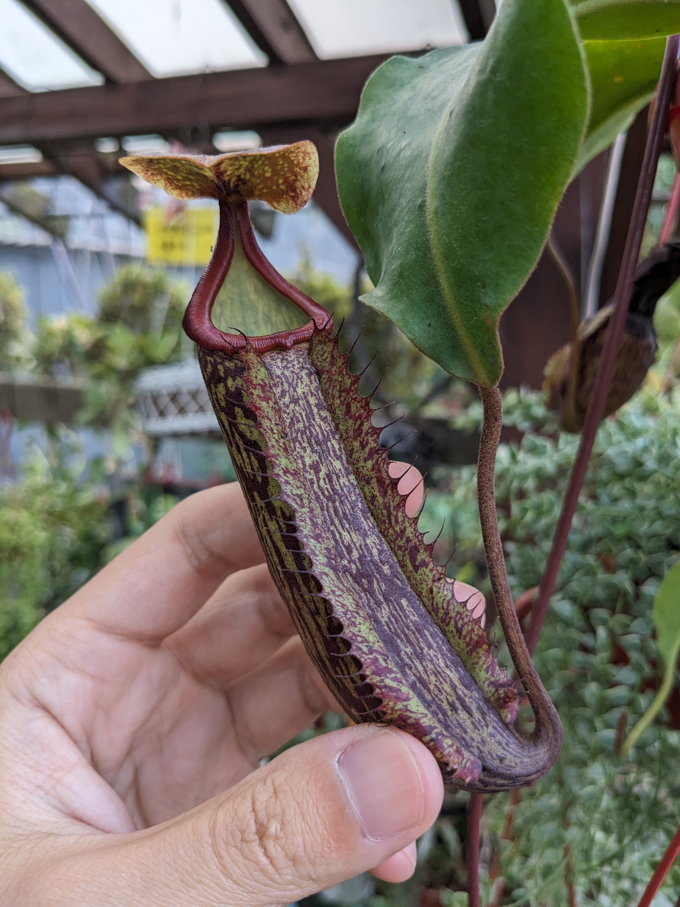
***

### 不明2號 unknown hyb no.2

***
來源：八角亭花市  
表現：瓶子太小了不確定，但有瓶子紋路  
敘述：從原本的盆栽內撿到的小禮物？！繼續努力維持生長
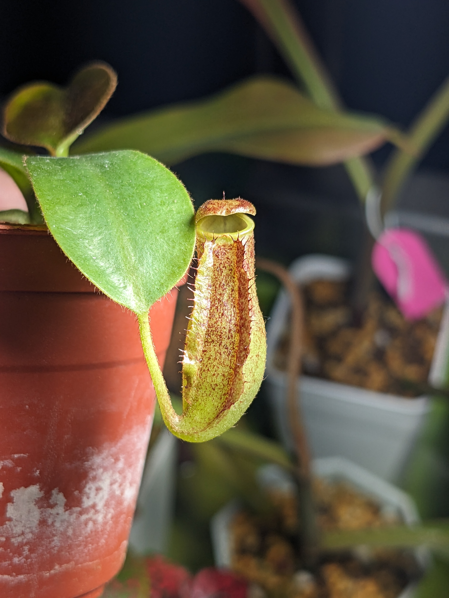
***

## 新手不要摸

### 巨大翼狀交顯目 alata-giant × spectabilis

***
表現：下位-看起來是比較鮮豔的翼狀豬籠草，上位-拉長瓶身的翼狀豬籠草，綠瓶紅綠花唇  
敘述：薊馬咬到整棵變形扭曲，但有時候還是可以結瓶，但沒注意好可能會整棵被攻陷

***

### (辛布亞×葫蘆)×寶特瓶 (sibuyanensis × ventricosa) × truncata

***
表現：類似葫蘆綠色的瓶子但帶有粉紅色唇  
敘述：極度怕熱，要近乎完全遮陰散光才能撐過，薊馬很愛(因為有雙倍吸引薊馬的血統)

***

### 辛布亞×寶特瓶 sibuyanensis × truncata

***
表現：長得很像寶特瓶但唇口更紅，目前裝草...  
敘述：可能是剛好抽到下下籤的一棵實生苗，目前表現不是很理想，怕熱且蟲子很愛

***

### 疑似民答那峨 cf. mindanaoensis

***
表現：拉長的瓶子，紅色瓶身綠色唇口  
敘述：怕熱到不行，但是持續苟延殘喘著，天氣轉涼會慢慢復活起來

***

### (高棉×顯目)×(勞氏×寶特瓶) (thorelii × spectabilis) × (lowii × truncata)

***
表現：幼幼瓶已出現花唇，但長大表現未知  
敘述：感覺十分可以期待的一棵複雜交種，但因為生長激素太複雜感覺還沒脫離不穩定

***

## 剛抵達待確認

### 盾葉毛-黃色幻影×維奇巴里奧-黃色幻彩 peltata yellow phantom × veitchii Bario yellow peristome

***
來源：日本山田  
表現：目前看起來是帶有略微紅斑的胖瓶子?  
敘述：有待觀察的狀態，實在是不知道
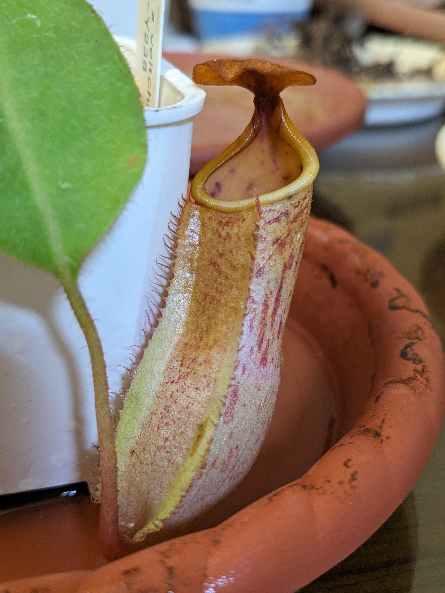
***

### 不明3號 unknown hyb no.3

***
來源：蝕友-徐大  
表現：似乎是有利齒的紅唇紅瓶?  
敘述：剛到來，身上很多細毛的一棵
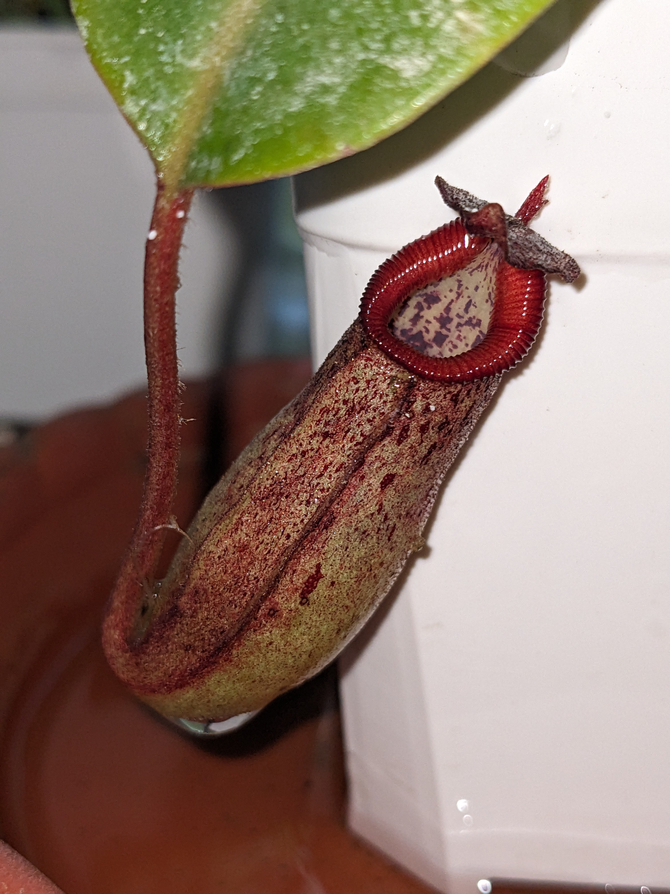
***

### 包希×(高地維奇×包希) boschiana × (veitchii H/L × boschiana)

***
表現：目前似乎確定是有略為花純的斑瓶  
敘述：感覺就被包希帶壞了

***

### 布凱 burkei

***
來源：應該是華陽組培  
表現：太小了不知道  
敘述：中高地指標物種，養的活代表很多東西可以挑戰看看
***

### 不明4號 unknown hyb no.4

***
來源：福田花市  
表現：有看到花唇  
敘述：也是從某個上游供應商做出來的不知道東東
***