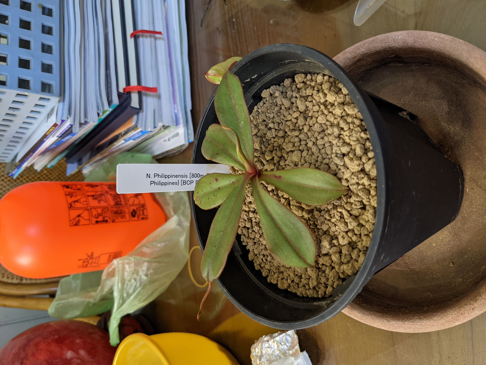
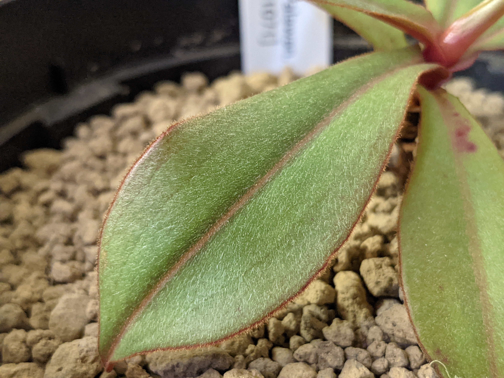
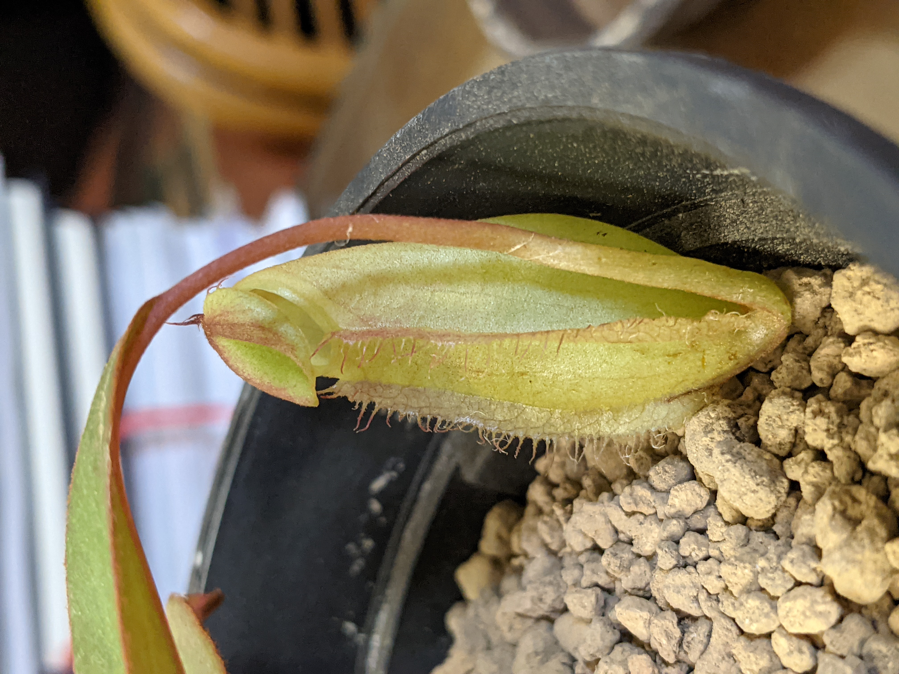
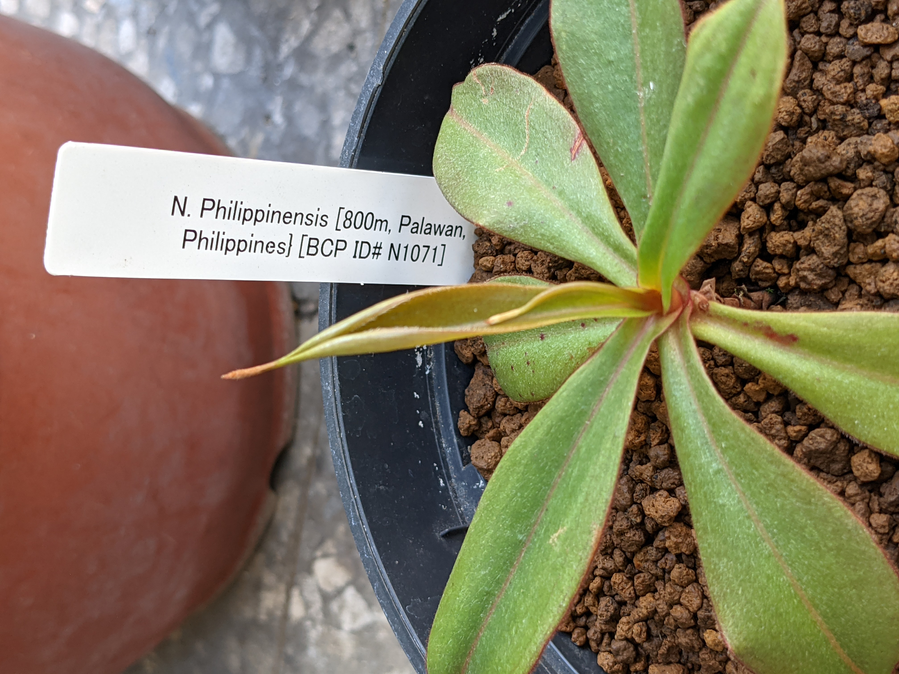
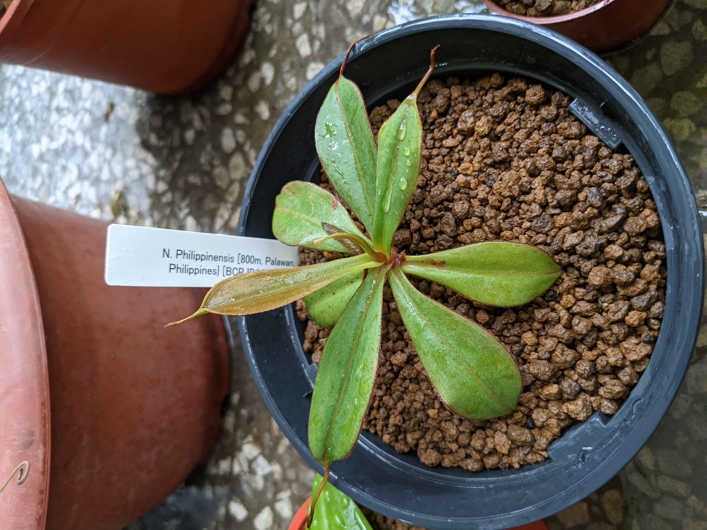
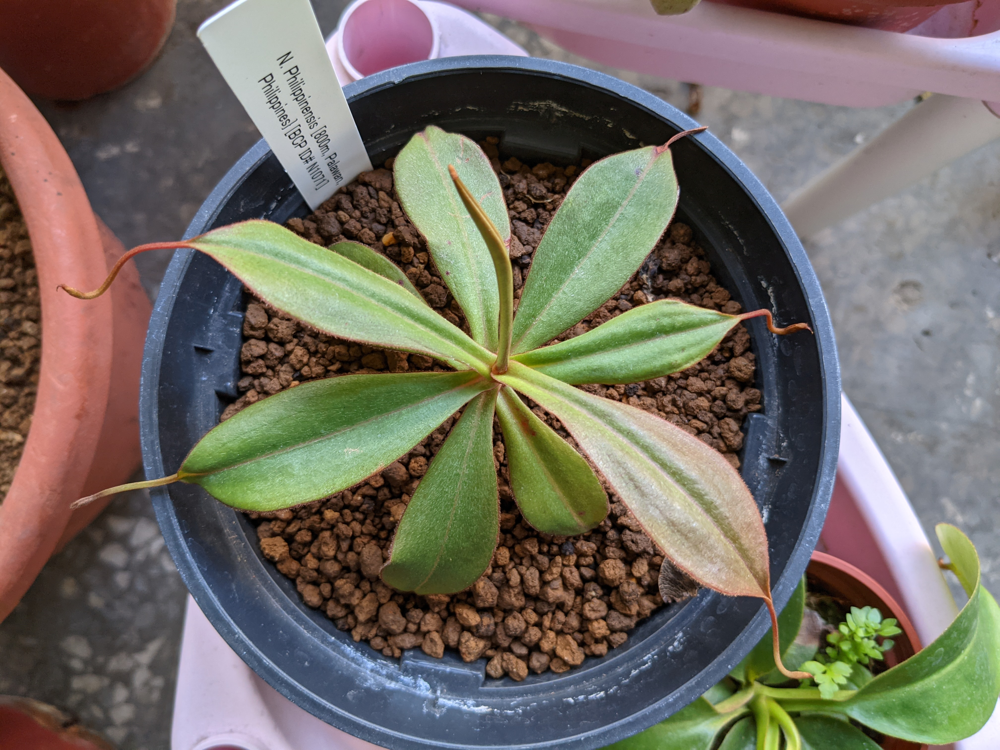
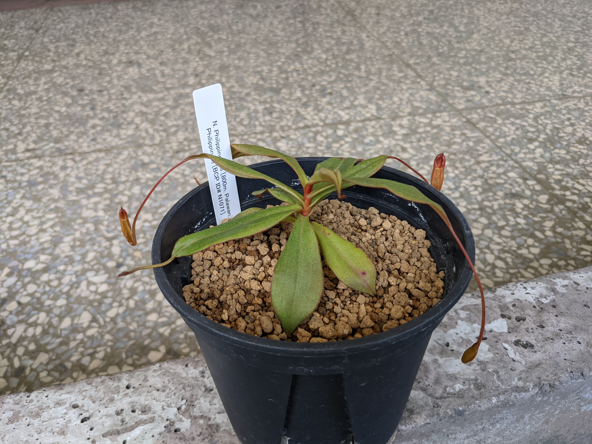
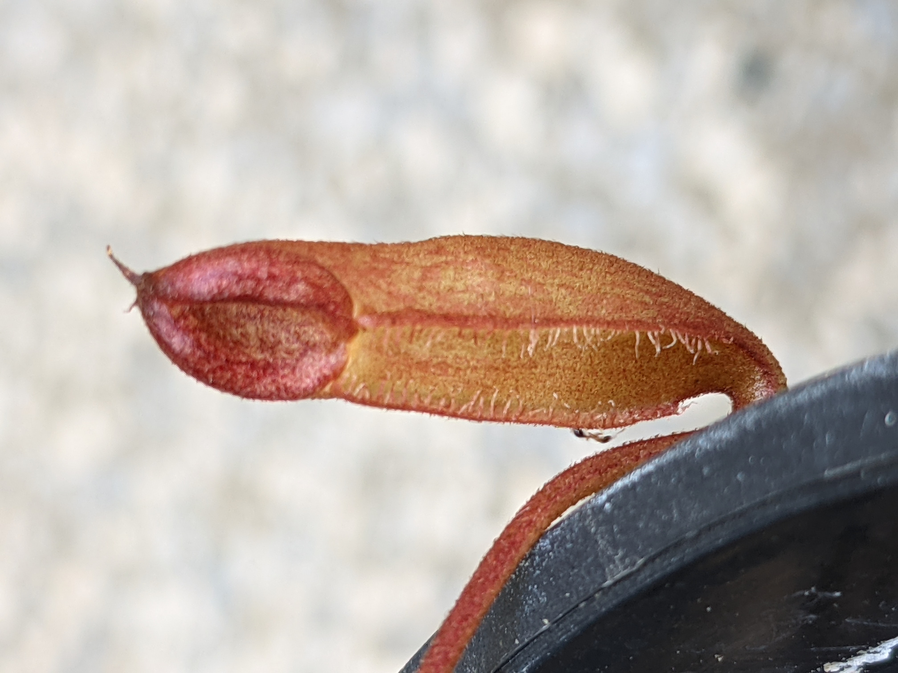
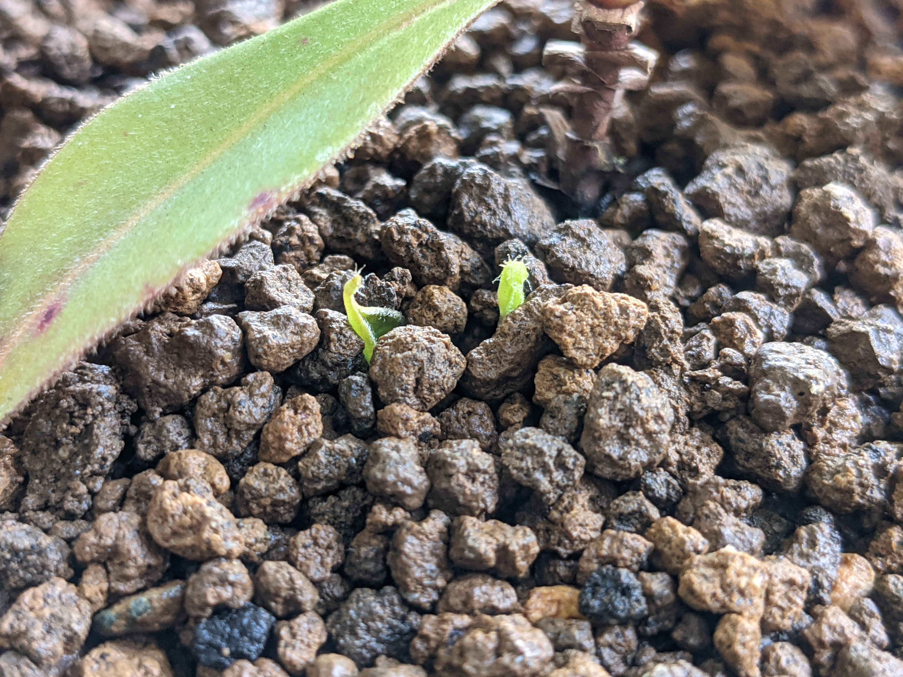

# 菲律賓豬籠草

這是從日本山田植物所帶回來的一棵原生種豬籠草，雖然說叫作菲律賓豬籠草，實際上卻住在菲律賓的外部島嶼 - 巴拉望島上。菲律賓豬籠草跟巴拉望豬籠草不一樣，沒辦法長出特別巨大的瓶子，但仍是屬於新手友善的品種。

## 2021-06-07 剛到手上

一開始就只用赤玉土中粒種植，那時候也沒有特別去條配比例，一如往常用赤玉土萬用的想法去種。於是就抓了超大包赤玉土以及使用青山盆來種植，增加透氣效果。


赤玉土是常用的食蟲植物介質，屬於酸性不肥沃的顆粒性質土壤


近看菲律賓豬籠草的表面，可以看到佈滿許多細毛，但大多數豬籠草並不會有這種特徵，~~這個觸感真的算是很不錯呢~~。

寄送來到台灣的時候還帶有一個捕蟲瓶，顏色偏黃綠，不太成熟的表現。說不定新瓶子可能會有更華麗的表現。但因為從日本出口來到臺灣，歷經了部分脫水以及長時間的無光照，肯定是需要時間調整狀態的。

## 種植日記環節

在藍狼家的騎樓環境種植了約一個月，頂芽有開始抽出新葉，生長勢似乎很強健。但很多時候不能仰賴只有一片新葉就覺得沾沾自喜，往後的持續觀察也是很重要的。

新葉子成功的伸展了，顏色看起來很奇特？不過很多豬籠草的新葉葉面色澤都不是綠色，所以屬於很正常的事情。

又過了快要一個月的時間，又展出一片新葉，通常穩定長出2片新葉應該是屬於穩定狀態了。但這個說法僅適用於已良好適應環境的豬籠草，~~難度偏高的豬籠草這樣去判斷無疑是作死行為~~。

又過了快要1個月的時間，可以看到已經在發育新的捕蟲瓶了，從這裡開始才是真的確定豬籠草適應且喜歡所居住的環境，捕蟲瓶的成長是一個很重要的指標。


濕度決定捕蟲瓶是否發育，而陽光決定捕蟲瓶最大尺寸，但仍只是推論


放大來看新的捕蟲瓶，看起來是屬於新鮮橘紅色系的瓶子外表，~~然後抱歉手機沒有微距鏡頭，看起來畫質慘不忍睹~~。

## 喔呀？這是什麼？

在赤玉土的表面露出了一點點的綠色葉面，這是菲律賓豬籠草的側芽。通常豬籠草長側芽是一個很罕見的現象，通常只發生在**植株高度已經很高**或者是**頂芽受到危機威脅**的時候才會出現側芽。結果菲律賓豬籠草已經出現了...


長側芽是有喜有憂，但需要仰賴種植者的判定了

