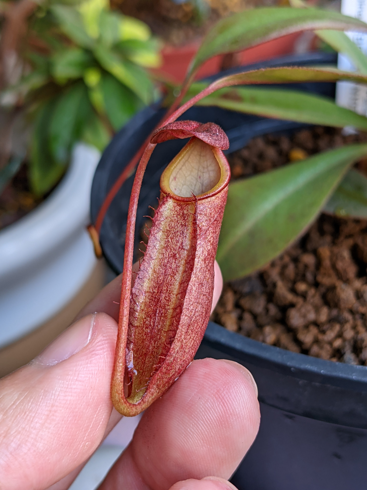
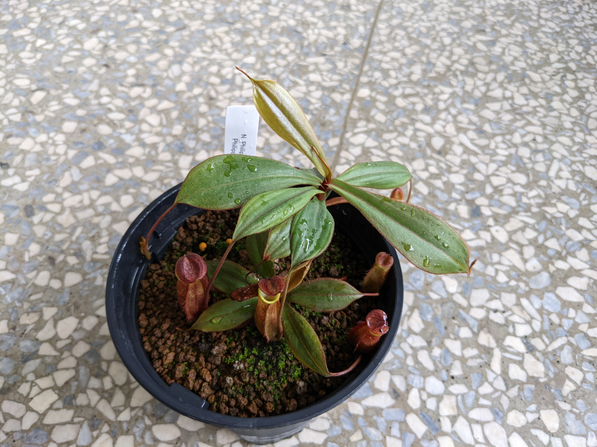
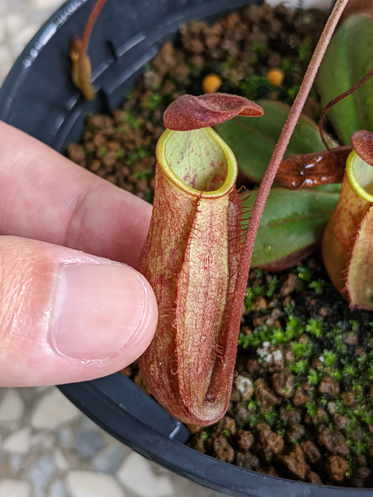
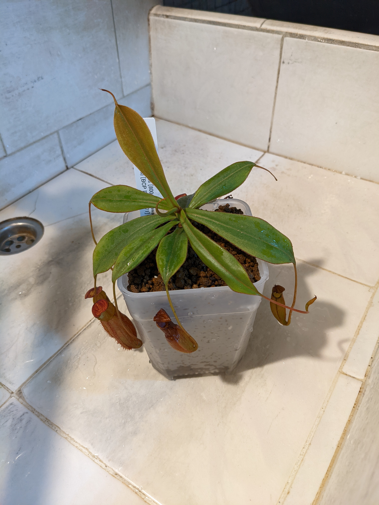

# 菲律賓豬籠草

這是從日本山田植物所帶回來的一棵原生種豬籠草，雖然說叫作菲律賓豬籠草，實際上卻住在菲律賓的外部島嶼 - 巴拉望島上。菲律賓豬籠草跟巴拉望豬籠草不一樣，沒辦法長出特別巨大的瓶子，但仍是屬於新手友善的品種。

## 2021-06-07 剛到手上

一開始就只用赤玉土中粒種植，那時候也沒有特別去條配比例，一如往常用赤玉土萬用的想法去種。於是就抓了超大包赤玉土以及使用青山盆來種植，增加透氣效果。


赤玉土是常用的食蟲植物介質，屬於酸性不肥沃的顆粒性質土壤  
可以混合鹿沼土與珍珠石增加透氣度


近看菲律賓豬籠草的表面，可以看到佈滿許多細毛，但大多數豬籠草並不會有這種特徵，~~這個觸感真的算是很不錯呢~~。

寄送來到臺灣的時候還帶有一個捕蟲瓶，顏色偏黃綠，不太成熟的表現。說不定新瓶子可能會有更華麗的表現。但因為從日本出口來到臺灣，歷經了部分脫水以及長時間的無光照，肯定是需要時間調整狀態的。

## 種植日記環節  
### 2021-7月

在藍狼家的騎樓環境種植了約一個月，頂芽有開始抽出新葉，生長勢似乎很強健。但很多時候不能仰賴只有一片新葉就覺得沾沾自喜，往後的持續觀察也是很重要的。

新葉子成功的伸展了，顏色看起來很奇特？不過很多豬籠草的新葉葉面色澤都不是綠色，所以屬於很正常的事情。

又過了快要一個月的時間，又展出一片新葉，通常穩定長出2片新葉應該是屬於穩定狀態了。但這個說法僅適用於已良好適應環境的豬籠草，~~難度偏高的豬籠草這樣去判斷無疑是作死行為~~。

### 2021-8月

又過了快要1個月的時間，可以看到已經在發育新的捕蟲瓶了，從這裡開始才是真的確定豬籠草適應且喜歡所居住的環境，捕蟲瓶的成長是一個很重要的指標。


濕度決定捕蟲瓶是否發育，而陽光決定捕蟲瓶最大尺寸，但仍只是推論


放大來看新的捕蟲瓶，看起來是屬於新鮮橘紅色系的瓶子外表，~~然後抱歉手機沒有微距鏡頭，看起來畫質慘不忍睹，但螞蟻倒是特別清楚欸~~。

## 喔呀？這是什麼？

在赤玉土的表面露出了一點點的綠色葉面，這是菲律賓豬籠草的側芽。通常豬籠草長側芽是一個很罕見的現象，通常只發生在**植株高度已經很高**或者是**頂芽受到危機威脅**的時候才會出現側芽。結果菲律賓豬籠草已經出現了...


長側芽是有喜有憂，但需要仰賴種植者的判定了


### 2021-9月

過了約莫半個月，側芽已經抽出4葉了，可以看到其中一片葉子有長出超小的捕蟲瓶，通常這種超小的捕蟲瓶是不太有功能的，但小巧可愛也無不好。

### 2021-11月


  
  


中途過了一陣子沒有特別去觀察，但看起來長出了不少好看的瓶子，可以看見菲律賓豬籠草是橘色斑紋瓶身帶著黃綠色的唇口，過一段時間唇口會轉變成橘黃色，唇肋帶有一點點尖銳的小尖牙（？），但對其他玩家級的收藏家可能不會是收藏首選。

那個冬天好像不太冷，算是整個很溫暖的狀態，豬籠草好像都長得還不錯？葉子穩定抽，瓶子穩定成長，這樣就是好事嗎？

### 2021-12月


  
  


然後，12月到了，**大量的葉子開始變黃，甚至枯萎了**。很多初次種植的玩家可能會非常緊張擔心，但對有經歷的玩家來說這是正常現象，畢竟植物也需要代謝，也會有適應不良的時候，仔細看可以發現都是底層的葉子在枯黃？那些都是夏天長出來的葉子，到了冬天比較不適應就會老化枯萎，因此是正常的喔！而且側芽也是正常的，所以妥的啦！

過了一陣子，我讓他住進去報紙架的溫室，因為實在是不知道他到底會不會怕冷，這樣做屬於比較保守也保險的做法。順便剪去了枯葉，這樣看起來比較整齊也美觀，~~雖然有人說不剪去枯葉更可以保持原生的樣貌且留住濕氣，但實際上真的影響很少~~。

2021年年底，那時候陽光不太強，瓶子的色澤變得比較不橘紅，但整體來說不影響菲律賓豬籠草的結瓶率，真的是相當強健就是了。

## 2022的日記
### 2022-4月

又過了數個月，~~絕對不是因為過年中間都懶得拍照~~，這個瓶子的唇上有一撇線條耶？但好像不太是花唇個體的可能性，因此繼續觀察看看。~~青山盆是借黃燭朱槿的但現在朱槿住的更大所以請放心~~。

### 2022-5月

很喜歡這種瓶子群聚的感覺，這樣看起來很像是在原生地，而且赤玉土表面長了一些苔類，看起來更像是原生地的表現了。~~那時候到底是怎麼了，手機晃的好慘喔，超絕失焦~~。

### 2022-6月


  
  


菲律賓豬籠草來到藍狼家已經一年了，看起來很穩定生長，但也沒有特別明顯跳葉的感覺？瓶子也是穩定生長著，不過就是希望可以再長大一點對吧？側芽也有母株本體的一半葉展了。

### 2022-7月


  
  
  


母株本體大概維持著4吋半的葉展，側芽則維持在3吋半的大小，我真的很佩服菲律賓豬籠草的結瓶率，因為幾乎每一片葉子都能成功發育一個捕蟲瓶，實在是超強的。但赤玉土表面也被入侵了，應該是某種蕨類的樣子，實在是惡鄰居啊。

## 挖出來換盆&切側芽的日子


  
  
  


種了一年多，中途有人說要排側芽耶？居然會有人想要這個原種，於是就答應了對方的請求，倒出來開始準備切側芽囉。看的出來母株根系其實沒有倒特別旺盛，側芽跟母株是共用同一個根系的，難怪會長不太大嗎？側芽切下來後放入了3吋的青山盆內種植，這次改用不一樣的配方，算是赤玉土加上鹿沼土一起了吧，這樣據說比較不會太硬？至於母株，這次盆栽縮水了，改用回4吋的透明塑膠盆吧，根系有受傷跟動到都需要讓豬籠草有時間恢復元氣的。


側芽扦插是高難度的挑戰，新手別嘗試！  
通常會需要1到6個月才會發根，不幸則衰竭或染菌死亡


看來母株似乎很有活力，瓶子都沒有在換盆後枯掉，真的是很健壯的原種，手邊其他豬籠草都沒這麼耐操，~~值了值了~~。

然而呢...側芽扦插失敗了，其實這種側芽的存活度還不是到很高，而且那時候時逢夏天真的很危險，容易脫水又染菌導致植株死亡。


如果想要扦插，盡可能保持在春秋兩季  
在夏天容易脫水染菌，冬天則因生長緩慢不發根而失敗


### 2022-11&12月

在換盆後的第一個新瓶子，這次色調好深紅？還是因為Pixel 5自動校正色調的問題？不過長出新瓶子真的是可喜可賀，減少不少擔憂。

到了2022的年底，~~一年真的很快就過了耶~~，在換盆後葉子伸展的尺寸有明顯成長了耶？不知道是不是因為側芽切割了~~雖然沒有活~~，所以母株可以專注集中養分生長呢？

## 2023的日記
### 2023-2月


  
  


過了一個年，這次可以看見葉展恢復到以往5吋的模樣，不過菲律賓豬籠草的瓶子表現似乎也就穩定是這個色調了。橘紅色的斑紋瓶身，搭配黃綠色的唇口，這就是這棵的表現了。


同一個原種的豬籠草也會有眾多表現  
這棵不代表所有的菲律賓豬籠草都是這樣的瓶子花紋


### 2023-6月

超級鮮豔的瓶子，那時候時逢天氣很好跟日照充足，所以整體感覺更鮮豔，等一下...~~如果用奇怪的方式握住我會不會被黃標~~？

這個瓶子的唇口是紅色的耶？應該是曬夠多陽光？~~還是偷擦口紅~~？

### 2023-8月

這個...泡水瓶，但在水中並不會因為泡水阻礙生長，反倒是長得不錯？可以看到瓶子內也有部分斑紋，這是以往的瓶子較少出現的特徵。豬籠草有時候需要更多溼氣，但泡水似乎也是個好方法呢。~~有看過其他玩家直接把幼籠泡在水中，有成功長大或者直接枯掉，端看那棵豬籠草是否喜歡了~~。

截至本篇打完的最新瓶子，希望下一個可以更好呢，但前陣子天氣很熱，葉片都畸形了，第一次遇到他也會受不了的溫度，今年夏天真是煉獄...

## 統整區
***
中文名稱：菲律賓豬籠草  
英文名稱：Nepenthes philippinensis  
種源：Nepenthes philippinensis {800m, Palawan, Philippines} [BCP ID# N1071]  
入手價格：3500円/進口價2000臺幣  
種植難度：新手也能照顧得當的原種豬籠草  
溫度適性：12°C至35°C (一年四季的變化)  
濕度：建議要有60%以上 (以豬籠草來說不算嚴苛)
***
