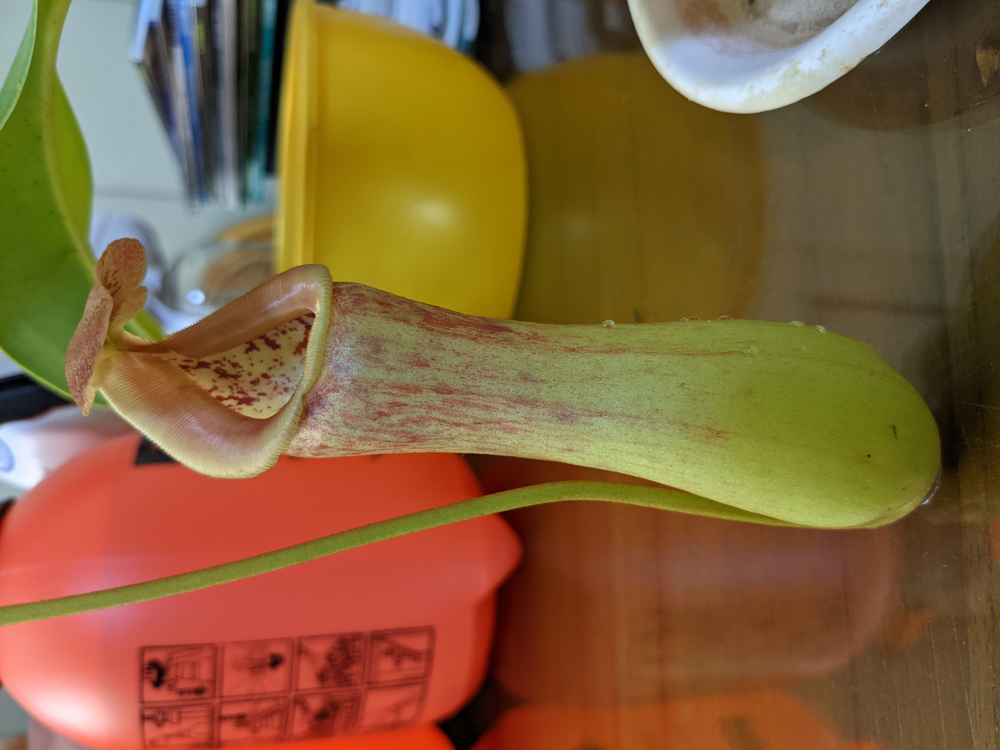

# 葫蘆×寶特瓶豬籠草(A個體)

這是一棵兩個原種交配後的豬籠草，豬籠草大多數是可以異種交配的，生出來的孩子會有父母親結合的特性，但是也會有交配後出現只有一方血統的問題？但這棵是完美結合了兩種父母的特性，因此可以期待。賣家公布的成熟植株照片可以養出家庭號寶特瓶尺寸的瓶子，不知道自己什麼時候也可以？


豬籠草大多是可以任意交配的，但少數血統相衝例外  
所以看到交配是很長一串有時候是蠻驚奇的


## 2021-07-01 抵達

這張照片可以看到這棵真的不小...要包這麼大一棵，賣家花費了很多心思努力包裝小心運送，真的是很用心的程度。


  
  


從這裡可以看到這瓶子腰身很明顯，瓶子身上也具有一些斑紋(但長大的瓶子會變淡不明顯)，可以看到唇肋線非常明顯，瓶子內也有部分花紋。

這次改用了其他配方，介質不再用純的赤玉土，改為赤玉土與鹿沼土各50%的混合比例種植了。~~可是跟菲律賓豬籠草差不多時間抵達卻用不同配方到底是怎麼了呢www~~

## 種植紀錄環節
### 2021-7月

過了大概10天，可以發現唇口顏色開始變紅了，然後唇口會逐漸反摺變成波浪的樣子，這些都是葫蘆豬籠草的特性。至於寶特瓶豬籠草，特性就是可以撐大豬籠草的尺寸，讓瓶子拉長，但也因為這點葫蘆豬籠草的葫蘆型態被拉長成為有腰身的瓶子。


葫蘆豬籠草是來自菲律賓的原生種  
因為長得很像葫蘆所以因此而得名  
[看照片點我](https://zh.wikipedia.org/zh-tw/%E8%91%AB%E8%8A%A6%E7%8C%AA%E7%AC%BC%E8%8D%89)


又過了一週，唇口的表現變得更加鮮紅，這應該差不多就定型了。讓人不敢置信的是，大多數收到的瓶子都會逐漸枯萎，但這瓶子卻越來越好，真的是體質很讚。

### 2021-8月

來到了8月份，通常是最酷暑的時間，瓶子唇口轉為暗紅色了，但依舊沒有枯萎，葫蘆的耐性真的很堅強。


  
  


長出了一片新葉，看起來很翠綠色，應該是陽光太強的緣故所以會變得比較淺色。但這個也不是壞事，只是植物的自我保護機制，變淺比較不會被曬傷。至於瓶子則是維持著差不多的模樣。


  
  


又出現了一個新瓶子，尺寸不算小，但也沒有變大，真希望有寶特瓶血統的加持下可以變更大啊。

差不多的狀態下，瓶口也是會變成深紅色，但這個瓶子的唇口皺褶有變得比較波浪一點點，這比較好看，但也是感謝葫蘆豬籠草的基因。

### 2021-10月


  
  


過了1個多月，又長出了一個新瓶子，但感覺有越來越小的趨勢，不知道是不是因為環境太熱所以有點討厭這樣的環境，葫蘆豬籠草是中高地型，但寶特瓶是屬於低地，交種混合下應該是適應力很強的才對。


豬籠草雖然是熱帶植物，但仍有海拔差異  
小於1000公尺屬於低海拔型  
1000到1500公尺屬於中海拔型  
1500到2500公尺屬於高海拔型  
2500以上超高海拔...沒有冷氣房是不可能存活了


### 2021-11月

11月了，有一個瓶子又繼續成長了，希望還是可以有比較大的瓶子，~~不然買這交種的用意是為了什麼呢？當然是大瓶子啊！~~


  
  


瓶子打開了啊...~~有這麼失望的嗎www~~。但這也沒關係，比起大瓶子長出來穩定成長其實是更優先的順序，畢竟要先把植株的體質撐起來才是重點。

### 2022-5月

這中間因為真的都沒什麼特殊的表現，所以只能說直接跳了好幾個月才有東西紀錄，豬籠草真的是長得很慢就是了。

這張照片是兩棵葫蘆交寶特瓶豬籠草一起比較的照片，本篇紀錄的是右邊那棵，可以看出葉子伸展的半徑更大，也更加健壯。比起剛收到的那時候，已經再往外擴展好幾公分了。~~真不愧是空間殺手，我的種植空間直接變少很多。~~


  
  


這個月的新瓶子，但是怎麼跟剛收到的瓶子差不多大啊...但發育倒是不會讓人失望就是了，結瓶率一直都很讓人滿意~~除了冬天的時候~~。

瓶子差不多就這樣定型了，但破了個小洞，不過是不影響功效啦...只是在完整性有強迫症的玩家可能會覺得心情不悅，但對藍狼來說倒是還好...

### 2022-6月


  
  


左邊是新的瓶子的照片，因為什麼原因不知道，瓶子突然小了一號，但不知道是我的錯覺還是只是不明顯，唇口感覺有點花唇的跡象？右邊的瓶子則是上個月的，唇口已經上色到很漂亮的鮮紅色，不知道各位有沒有注意到螞蟻呢？


  
  


又有新的瓶子打開了，好翠綠...至少尺寸拉回原本的標準了。葉展的部分有越來越大的狀態，我的空間就這樣一直被吃掉了...

哇！？這次的瓶子波浪唇好明顯。以前不曾養到這副模樣的，現在終於可以往賣家示範的照片更近一步了。

### 2022-7月


  
  


繼上個月的那個瓶子，一如往常越來越鮮紅的唇口，搭配上波浪唇，加上逐漸變大的瓶子~~雖然沒增加多大~~，這才是兩個親本的會出現的表現。

結果又一個綠色的瓶子...但夏天真的很熱就放過他吧，能結瓶已經是非常努力的表現了。


  
  


7月中，再度拿出來檢視一下葉展的部分，看起來真的超級大...可以說是佔用了3到4棵3吋盆豬籠草的範圍，不過這就是養得越大，瓶子才有機會越來越大是吧？

{{< carousel images="{./images/20220715C.jpg, ./images/20220718.jpg, ./images/20220725.jpg, ./images/20220804}" >}}

這裡可以看到一個瓶子逐漸成長且唇口轉紅的過程，可以發現波浪唇其實是在後期才會開始摺出痕跡的。
